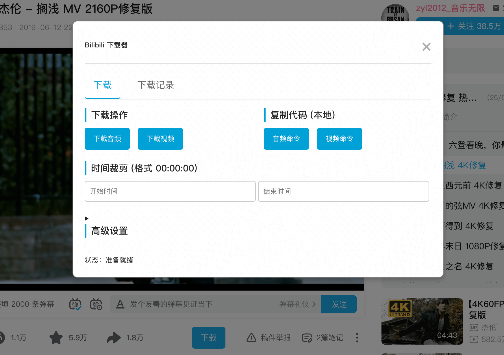

# Bilibili Downloader

哔哩哔哩（B 站）音视频下载油猴脚本，通过本地部署的 Docker 服务，为您提供一个稳定、快速、无带宽限制且高度可定制的下载体验。

(Hi there，我的云服务器小水管给大家提供了快4年的稳定服务。从 2025/7/4 开始，要大家自行部署后端服务啦。花了几小时重构了前后端，希望给大家带来更好的体验)




## 其他选择

> 你也可以用我的另一个开源项目来下载 b 站视频 https://github.com/foamzou/media-get

## 核心优势

- **本地部署**: 所有下载和转码任务均在您自己的电脑上完成，无需求助于任何公共服务器。
- **一键部署**: 使用 `docker-compose`，一条命令即可启动后端服务。
- **无限制**: 不再有公共服务的小水管带宽限制，下载速度取决于您自己的网络。
- **高度可定制**: 您可以自由指定文件名格式。
- **功能丰富**: 支持视频下载、时间裁剪、实时进度、智能检查、下载历史、用户引导等多种功能。
- **隐私安全**: 您的所有操作和文件均保留在本地。

## 工作原理

本工具由两部分组成：

1.  **前端 (`index.user.js`)**: 一个油猴脚本，作为用户界面，负责解析页面信息、与后端服务通信、并实时展示下载状态。
2.  **后端 (`server.js`)**: 一个 Node.js 服务，它接收下载请求，将其放入一个异步任务队列，并使用`ffmpeg`和`curl`在后台处理真正的下载和转码，同时提供接口供前端轮询任务状态。

## 部署方案

我们提供两种部署后端服务的方式，您可以根据自己的喜好选择其一。**Docker 是推荐的方式**，因为它能更好地隔离环境。

### 方案一：使用 Docker (推荐)

此方案通过 `docker-compose` 自动构建和运行服务容器。

#### 第一步：准备环境

您需要预先在您的电脑上安装以下软件：

- [Docker](https://www.docker.com/products/docker-desktop/) (包含 `docker-compose`)：用于运行后端服务。
- [Tampermonkey](https://www.tampermonkey.net/) (或类似的油猴插件)：用于在浏览器中安装和管理用户脚本。

#### 第二步：下载项目文件

将本仓库克隆或下载到您电脑的任意位置。

```bash
git clone https://github.com/foamzou/bilibili-downloader.git
cd bilibili-downloader
```

#### 第三步：启动后端服务

在项目根目录（`bilibili-downloader`）下打开终端，运行以下 **单条** 命令即可：

```bash
docker-compose up -d
```

服务现在已经在后台运行。默认情况下，所有下载的文件都会被保存在项目根目录下的 `downloaded` 文件夹中。您也可以修改 `docker-compose.yml` 文件来指定不同的本地目录。

#### 第四步：安装油猴脚本

点击 <a href="https://github.com/foamzou/bilibili-downloader/raw/main/index.user.js" target="_blank">这里</a> 安装或更新。

### 方案二：在本地直接运行 (非 Docker)

此方案需要您手动安装依赖并在您的操作系统上直接运行 Node.js 服务。

#### 第一步：安装必备软件

您需要确保您的电脑上已经安装了以下软件：

- **[Node.js](https://nodejs.org/)** (推荐 LTS 版本)
- **[FFmpeg](https://ffmpeg.org/download.html)** (非常重要，请确保 `ffmpeg` 命令可以在您的终端或命令行中直接运行)
- **[Git](https://git-scm.com/downloads)**

_提示：`curl` 在 macOS 和 Linux 中通常已预装。Windows 用户可能需要自行安装或使用系统内置工具。_

#### 第二步：下载并安装项目

```bash
# 1. 克隆项目仓库
git clone https://github.com/foamzou/bilibili-downloader.git

# 2. 进入项目目录
cd bilibili-downloader

# 3. 安装 Node.js 依赖
npm install
```

#### 第三步：运行后端服务

在项目根目录的终端中，运行以下命令：

```bash
node server.js
```

看到 `Server listening on port 5577` 的提示即表示服务已成功启动。所有下载的文件将默认保存在项目的 `downloaded` 文件夹内。

**请注意：** 您需要保持这个终端窗口的开启状态来维持服务的运行，或者使用 pm2 来保持服务在后台运行。

#### 第四步：安装油猴脚本

此步骤与 Docker 方案完全相同，请参考上文。

> 或者，你也可以点击 <a href="https://github.com/foamzou/bilibili-downloader/raw/main/index.user.js" target="_blank">这里</a> 安装或更新。

## 使用方法

1.  确保您的后端服务（无论是 Docker 还是本地服务）正在运行。
2.  打开任意一个 B 站视频页面。
3.  在视频标题的右侧，您会看到一个蓝色的 **“下载”** 按钮。
4.  点击该按钮，会弹出一个配置和操作窗口。

### 新用户引导

如果您是第一次使用，或者您的本地服务没有运行，弹窗顶部会自动显示一个引导提示，其中包含启动服务的命令，并支持一键复制。

### 功能介绍

- **智能状态感知**:
  - **文件存在检查**: 在您点击下载前，脚本会**自动检查**文件是否已存在于本地目录，如果存在，则禁用下载按钮，避免重复下载。
  - **实时进度更新**: 下载开始后，历史记录区域会**实时显示**任务所处的阶段（下载中、合并中、已完成）以及**下载进度百分比**，让您对大文件的下载过程了如指掌。
- **下载音频/视频**: 直接调用本地 Docker 服务进行下载和转码。视频下载会自动合并音轨和视频轨。
- **复制代码**: 生成在您本地直接运行的 `curl` + `ffmpeg` 命令，适合高级用户。
- **时间裁剪**: 在下载前指定开始和结束时间，只截取您需要的片段。
- **下载历史**: 自动记录最近 20 条下载，并提供“复制路径”按钮，方便您快速定位文件。
- **高级设置**:
  - **存储子目录**: 在您挂载的根目录 (`./downloaded`) 下创建并使用一个子目录来存放文件。
  - **文件名格式**: 自定义保存的文件名。可用占位符：
    - `{title}`: 视频标题
    - `{vid}`: B 站视频 ID (如 `BV1xx411c7mD`)
    - `{year}`: 年份 (YYYY)
    - `{month}`: 月份 (MM)
    - `{day}`: 日期 (DD)
  - **后端服务地址**: 默认为 `http://localhost:5577`，通常无需修改。

## 常见问题

- **点击下载没反应/提示连接失败**:
  - 检查 Docker 服务是否正在运行 (`docker-compose ps`)。
  - 检查防火墙是否阻止了 `5577` 端口的访问。
  - 检查油猴脚本高级设置中的“后端服务地址”是否正确。
- **如何停止服务?**
  在项目目录下运行 `docker-compose down`。
- **如何查看日志?**
  在项目目录下运行 `docker-compose logs -f`。

## 赞赏

如果这个项目对您有帮助，可以请我喝杯奶茶吗，蜜雪冰城也可以噢，谢谢。


